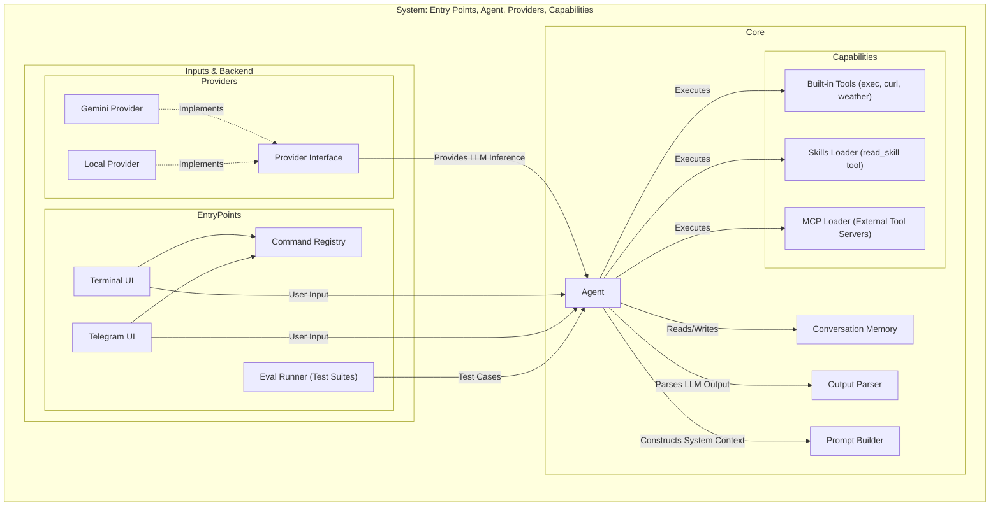

# minimal-valuable-harness
 

A minimal, yet powerful, harness for building and testing LLM-powered agentic workflows.

## Table of Contents
- [🚀 Quick Start (TL;DR)](#-quick-start-tldr)
- [🏗 Architecture](#-architecture)
- [🛠 Prerequisites](#-prerequisites)
- [⚙️ Installation & Configuration](#-installation--configuration)
- [💡 Usage](#-usage)
- [💻 Development](#-development)

## 🚀 Quick Start (TL;DR)

**1. Setup:**
```bash
npm install
cp .env.example .env
# Add GEMINI_API_KEY (or set LLM_PROVIDER=local) to .env. For Telegram, also add TELEGRAM_BOT_TOKEN & TELEGRAM_ALLOWED_USERS.
```

**2. Launch Options:**
- **Terminal CLI Mode** (default):
  ```bash
  npm start
  ```
- **Telegram Bot Mode**:
  ```bash
  npm start -- --ui telegram
  ```

## 🏗 Architecture

The framework's architecture is designed modularly, encapsulating the agent core, LLM providers, and capabilities into a single scalable engine.



### Key Components
- **Entry Points & Interfaces**: The framework can be run via CLI (`TerminalUI`), a Telegram bot (`TelegramUI`), or headlessly via the evaluation system (`evals`).
- **Agent Runtime**: The central `Agent` class orchestrates the conversation loop. It maintains history (`ConversationMemory`), assembles context (`PromptBuilder`), and parses LLM responses (`OutputParser`).
- **LLM Providers**: A provider abstraction allows seamlessly swapping models (Gemini, Local, etc.).
- **Capabilities**: The agent can invoke built-in utilities, load external skills (Skills System), and connect extensions via the Model Context Protocol (MCP).

## 🛠 Prerequisites

- **Node.js**: v18.0.0 or higher (for modern JS features support).
- **Package Manager**: npm or pnpm.
- **LLM Backend**: A Gemini API token (for cloud inference) OR a running local model (if using the local provider).

## ⚙️ Installation & Configuration

1. Install dependencies:
   ```bash
   npm install
   ```

2. Configure your environment variables. Create a `.env` file in the project root:
   ```env
   # LLM Configuration (Choose cloud or local)
   GEMINI_API_KEY=your_api_key_here
   # OR for local models:
   # LLM_PROVIDER=local
   # LOCAL_CONTEXT_LENGTH=16000

   # Optional for Telegram UI
   TELEGRAM_BOT_TOKEN=your_telegram_bot_token
   TELEGRAM_ALLOWED_USERS=your_username,another_username
   ```

## 💡 Usage

### Interactive CLI

Start the basic terminal version:
```bash
npm start
```
You can also pass a prompt directly:
```bash
npm start -- "What is the weather in Tokyo?"
```

<details>
<summary><b>Available Slash Commands (/help)</b></summary>

Inside an interactive terminal or bot session, you can use:
- `/help` - Show available commands
- `/skills` - Show available skills and their descriptions
- `/tools` - Show available tools
- `/clear` - Clear the agent's context/history
- `/history` - Show full conversation history
- `/debug` - Toggle debug logging
- `/exit` or `/quit` - Exit the application
</details>

### Telegram Bot

Start the bot using the `--ui telegram` flag (ensure `TELEGRAM_BOT_TOKEN` and `TELEGRAM_ALLOWED_USERS` are set in `.env`):
```bash
npm start -- --ui telegram
```

<details>
<summary><b>Connecting MCP Servers</b></summary>

To integrate with external tools via the Model Context Protocol, create an `mcp.json` file in the project root:
```json
{
  "mcpServers": {
    "sqlite": {
      "command": "npx",
      "args": ["-y", "mcp-sqlite-server", "test.db"],
      "env": {}
    }
  }
}
```
The framework will automatically detect this configuration and provide the agent access to these servers upon startup.
</details>

<details>
<summary><b>Debug Mode</b></summary>

Enable debug mode using the `/debug` command or by setting the `DEBUG=true` environment variable. 
It's an excellent tool for exploring the internals, revealing:
- When the agent decides to invoke tools.
- Arguments passed to skills.
- Raw responses returned by tools.
</details>

## 💻 Development

The project is designed with a focus on minimal dependencies and code transparency.

**Project Structure:**
- `src/harness/core` - Core logic for the agent and memory.
- `src/harness/tools` - Built-in tools (`exec`, `curl`, `weather`).
- `src/harness/mcp` - Model Context Protocol loader and parser.
- `src/ui` - Entry points (CLI, Telegram).
- `src/evals` - Agent performance evaluation system.

**Running Tests:**
The framework includes its own auto-evaluation system for skills and tools:
```bash
# Run all test suites
npm run eval

# Run a specific test suite (e.g., shop-mcp.eval.ts)
npm run eval -- --suite shop
```